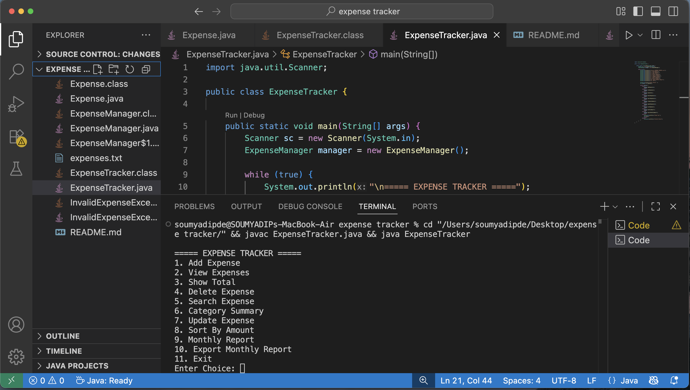

# Expense Tracker System

A console-based Java project for tracking personal expenses.

## Features
- Add expense
- View expenses
- Delete expense
- Update expense
- Search expense
- Category summary
- Sort expenses by amount
- Save and load data from file
- Monthly report
- Export monthly report

## Tech Stack
- Java
- File Handling
- OOP
- ArrayList
- Scanner

## How to Run
javac InvalidExpenseException.java Expense.java ExpenseManager.java ExpenseTracker.java
java ExpenseTracker

## Screenshot

### Expense Tracker Menu

